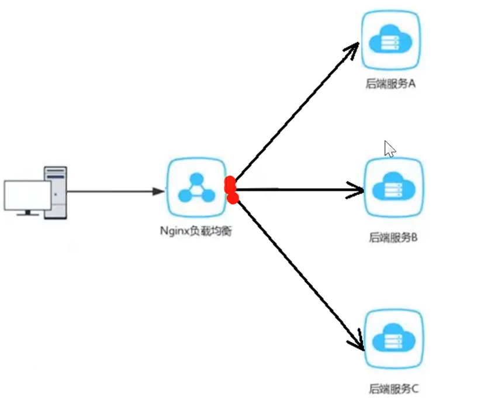
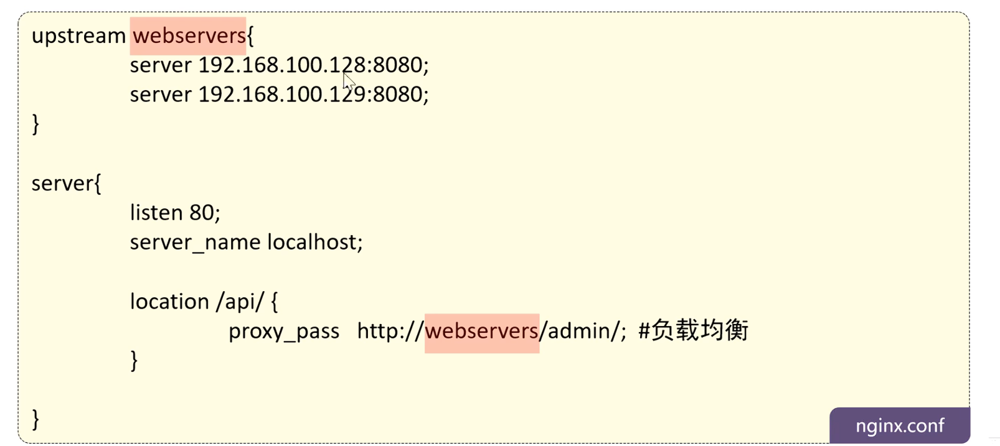
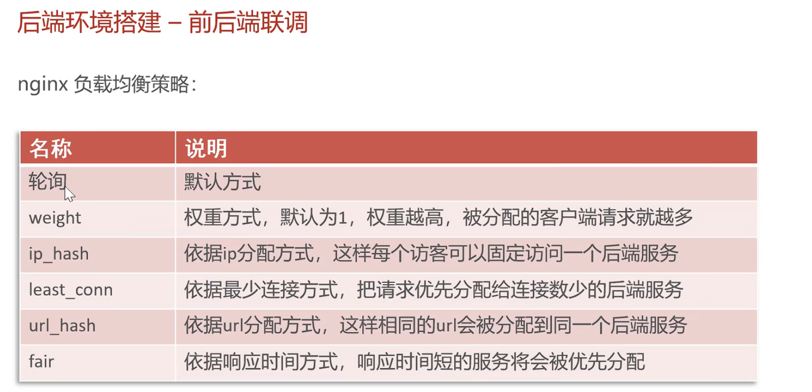
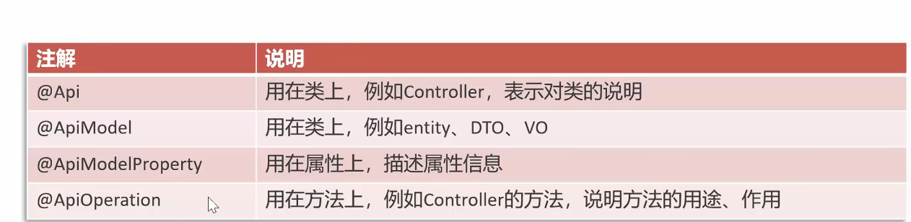

# sky takeout

## day1:

考虑远程服务器配 docker mysql8 作为数据库;
主机暂时当前后端调试


设置服务器,要保证服务器安全,最好:

关闭 3306 端口

22 端口只开放固定ip : 这个由于没有固定公网ip做不到

密匙登录,禁止root登录,禁止使用密码登录

怕炸机暂时不关root了

#### 第一步:安全服务器配置

1. 生成公钥

```cmd
ssh-keygen -t ed25519
```

设置路径和passphrase

生成公钥和私钥

私钥自己保存,公钥给服务器

查看公钥:

```cmd
type $env:USERPROFILE\.ssh\id_ed25519.pub
```


2. 创建用户yuan并给权限

```
adduser yuan
```

密码/full name

3. 验证

```cmd
id yuan
getent passwd yuan
ls -ld /home/yuan
```

4. 给 yuan sudo 权限

```
usermod -aG sudo yuan
groups yuan
```


5. 把公钥放到服务器

```bash
# 先切到 yuan
sudo -u yuan mkdir -p /home/yuan/.ssh
sudo -u yuan chmod 700 /home/yuan/.ssh

# 把公钥追加进去
echo 'ssh-ed25519 AAAA... x@DESKTOP-...' | sudo -u yuan tee -a /home/yuan/.ssh/authorized_keys > /dev/null
// 这里可以自己编辑更方便

sudo -u yuan chmod 600 /home/yuan/.ssh/authorized_keys
sudo -u yuan ls -l /home/yuan/.ssh
```

验证

```bash
sudo -u yuan wc -l /home/yuan/.ssh/authorized_keys
sudo -u yuan head -n 1 /home/yuan/.ssh/authorized_keys
```


6. 修改 SSH 配置：禁用密码登录

```bash
sudo nano /etc/ssh/sshd_config.d/99-hardening.conf
//nano 操作写入 
PermitRootLogin yes
PubkeyAuthentication yes
PasswordAuthentication no
```

改完先检查语法：

```bash
sudo sshd -t
```

无输出 = 通过。
再看“最终生效值”（你贴过类似结果）：

```bash
sudo sshd -T | egrep 'permitrootlogin|pubkeyauthentication|passwordauthentication'
```

最终看到类似：

```
permitrootlogin yes
pubkeyauthentication yes
passwordauthentication no
```

重载服务生效

```
sudo systemctl reload ssh
```


#### 第二步:数据库创建连接idea

##### A. 安装 Docker

```bash
sudo apt update
sudo apt install -y docker.io docker-compose-plugin
sudo systemctl enable --now docker
sudo usermod -aG docker yuan
# 这里建议重新登录一下（或 newgrp docker）
```

##### B. 配镜像加速（如果你所在网络经常超时）

```bash
sudo mkdir -p /etc/docker
sudo nano /etc/docker/daemon.json
```

填：

```bash
{
  "registry-mirrors": ["https://YOUR_MIRROR_HERE"]
}
```

重启：

```bash
sudo systemctl restart docker
```

验证：

```bash
docker info | sed -n '/Registry Mirrors/,+5p'
```

##### C. 准备 compose 目录和文件（注意这里是 bash，不是 java）

```bash
mkdir -p ~/mysql/{data,init}
cd ~/mysql
# 写 docker-compose.yml
```

##### D. 启动

```bash
docker compose up -d
docker ps
docker logs -n 50 mysql8
```

进入 MySQL：

```bash
docker exec -it mysql8 mysql -uroot -p
```


##### E.idea

主机 localhost 端口 3306

用户/ 密码

ssh:

隧道配置

输入主机/密钥


测试连接成功


**idea的数据库只是方便查表,不能作为后端跟数据库的连接隧道**


#### 第三步:从导入 SQL 到前后端联通


本机执行

```bash
CREATE DATABASE IF NOT EXISTS `sky_take_out`;


-- [42000][1044] Access denied for user 'app'@'%' to database 'sky_take_out'
```

原因:业务账号 `app`（权限受限），没有 `CREATE DATABASE` 权限


1）先用 root 进入容器内 MySQL：

```bash
docker ps
docker exec -it mysql8 mysql -uroot -p
```

2）用 root 创建库：

```sql
CREATE DATABASE IF NOT EXISTS sky_take_out
  DEFAULT CHARACTER SET utf8mb4
  COLLATE utf8mb4_0900_ai_ci;
```

3）给 app 授权:只授权这个库

```sql
GRANT ALL PRIVILEGES ON sky_take_out.* TO 'app'@'%';
FLUSH PRIVILEGES;
exit;
```


IDEA 直接 Run SQL Script


**小问题:(GPT至高神)**

找不到主类 : IDEA安装目录下的maven不能接受有空格(可能)

mvn -v 弹出 java usage: G盘下隐藏.mvn配置文件,删除

编译失败：Lombok/Getter/日志字段缺失 + JDK 版本问题 ,改为JDK17


**前端登录无响应:**

“登录中…”卡住

**后端关键错误日志：**

```
DruidDataSource : create connection SQLException, url: jdbc:mysql://localhost:3306/sky_take_out...
Communications link failure
```

**问题定位：**

A.

- application-dev.yml 没有设置自己数据库的账号密码

B.

- IDEA 的 Data Source 连接成功是因为 **IDEA 自己开了 SSH 隧道**
- Spring Boot 不会复用 IDEA 隧道
- 你后端写 `localhost:3306` 指向的是你 Windows 本机，不是云服务器的 MySQL

**设置系统级 SSH 本地端口转发**

ssh -N -L 127.0.0.1:3307:127.0.0.1:3306 yuan@<SERVER_IP>

- `-N`：不执行远程命令，只做转发
- `127.0.0.1:3307`：本机监听端口
- `127.0.0.1:3306`：远端服务器上的 MySQL 暴露在服务器本机（你的容器端口映射是 `127.0.0.1:3306->3306`，正好匹配）

窗口“卡住”正常，隧道要一直开着。

修改application-dev.yml

- host：`127.0.0.1`
- port：`3307`
- db：`sky_take_out`
- username
  password

修改完即可登录,联通前后端


**防止密码泄露:**

##### `application-dev.yml`（GitHub）

```
spring:
  config:
    import: "optional:classpath:application-dev-local.yml"

sky:
  datasource:
    driver-class-name: com.mysql.cj.jdbc.Driver
    host: 127.0.0.1
    port: 3307
    database: sky_take_out
    username: ${DB_USERNAME:}
    password: ${DB_PASSWORD:}
```

说明：

- `spring.config.import` 在顶层。
- `${DB_USERNAME:}` 这个 `:` 后面空着，表示没设置也能启动到加载 local 文件为止（更容错）。

##### 2）`application-dev-local.yml`（**不提交**，本地私密）

```java
sky:
  datasource:
    username: xxx
    password: xxx
```

##### 3）`.gitignore` 加一条（必须）

```java
**/application-*-local.yml
```


---------------------------

### 项目内容

为什么前端请求

http://localhost/api/employee/login

后端能收到

通过nginx反向代理,将前端发送的动态请求由nginx转发到后端服务器


1. nginx 缓存,提高访问速度
2. 堵在均衡,所谓负载均衡,就是把大量的请求按照我们指定的方式均衡的分配给集群中的每台服务器



3. 保证后端服务安全


如何设置:


nginx.conf 文件

反向代理:

        # 反向代理,处理管理端发送的请求
        location /api/ {
    		proxy_pass   http://localhost:8080/admin/;
        }

匹配到 /api/xxx 就转发到  http://localhost:8080/admin/xxx


负载均衡:



匹配到之后自动 设置服务器负载




**完善登录功能**

1.数据库密码加密

改为bcrypt加密

A.

SERER模块

```xml
<dependency>
    <groupId>org.springframework.security</groupId>
    <artifactId>spring-security-crypto</artifactId>
</dependency>
```

application-dev.yml添加

```xml
security:
  password:
    bcrypt-cost: 12
```

sky-config下面:

新建类:

PasswordConfiguration.java

```java
package com.sky.config;
import org.springframework.context.annotation.Bean;
import org.springframework.context.annotation.Configuration;
import org.springframework.security.crypto.bcrypt.BCryptPasswordEncoder;
import org.springframework.security.crypto.password.PasswordEncoder;

@Configuration
public class PasswordConfiguration {

    @Bean
    public PasswordEncoder passwordEncoder(SecurityPasswordProperties props) {
        return new BCryptPasswordEncoder(props.getBcryptCost());
    }
}

```

加一个属性类

```java
package com.sky.config;

import org.springframework.boot.context.properties.ConfigurationProperties;
import org.springframework.stereotype.Component;

@Component
@ConfigurationProperties(prefix = "security.password")
public class SecurityPasswordProperties {
    private int bcryptCost = 12;
    public int getBcryptCost() { return bcryptCost; }
    public void setBcryptCost(int bcryptCost) { this.bcryptCost = bcryptCost; }
}

```


修改login函数

```java
import org.springframework.security.crypto.password.PasswordEncoder; // 哈希校验
@Override
    public Employee login(EmployeeLoginDTO employeeLoginDTO) {
        String username = employeeLoginDTO.getUsername();
        String password = employeeLoginDTO.getPassword();

        //1、根据用户名查询数据库中的数据
        Employee employee = employeeMapper.getByUsername(username);

        //2、处理各种异常情况（用户名不存在、密码不对、账号被锁定）
        if (employee == null) {
            //账号不存在
            throw new AccountNotFoundException(MessageConstant.ACCOUNT_NOT_FOUND);
        }

        //密码比对

        // password：前端传来的明文
        // employee.getPassword()：数据库里存的 bcrypt 哈希串（例如 $2b$12$...）
        if (!passwordEncoder.matches(password, employee.getPassword())) {
            throw new PasswordErrorException(MessageConstant.PASSWORD_ERROR);
        }

        if (employee.getStatus() == StatusConstant.DISABLE) {
            //账号被锁定
            throw new AccountLockedException(MessageConstant.ACCOUNT_LOCKED);
        }

        //3、返回实体对象
        return employee;
    }
```

创建临时类 修改数据库密码测试

```java
package com.sky;

import org.springframework.security.crypto.bcrypt.BCryptPasswordEncoder;
import org.springframework.security.crypto.password.PasswordEncoder;

public class temp {
    public static void main(String[] args) {
        PasswordEncoder pe = new BCryptPasswordEncoder(12);
        System.out.println(pe.encode("123456"));
    }
}
```

```
$2a$12$9/Wa/2.RM6YIZWr8bM9xjudaoarqQ7c.Ygd2W757t7V.jzjBRWj9O
```

删除这个类


测试成功


